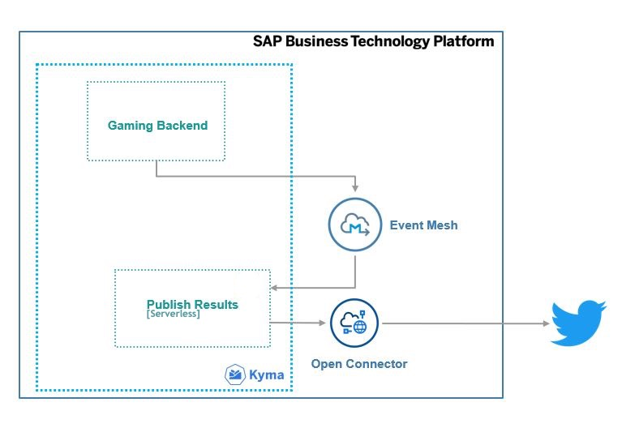
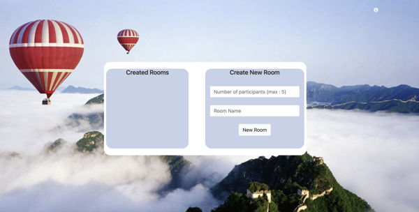

# Gamified Cloud Kyma Nodejs Application

## Description

The Gamified Reference Application is a sample Node.js application that showcases how to use and implement WebSockets, SAP BTP, serverless runtime, SAP Open Connectors and others. This application runs on the SAP BTP, Cloud Foundry environment, and the SAP BTP, Kyma environment. The current scope of the application is to demonstrate the capabilities of the SAP Event Mesh service for creating service instances, queues, subscriptions for these queue, and sending and consuming the messages through APIs.

## Architecture

### Solution Diagram
The Gamified Reference Application is developed using Node.js and runs on the SAP Business Technology Platform (SAP BTP). It consumes services in SAP BTP like SAP Event Mesh and SAP Open Connectors. The events generated in the gaming backend are inserted into a queue in the Event Mesh service. The application consumes these events to calculate the game result, and the serverless function publishes the result on Twitter via the SAP Open Connectors.

## Game Flow

### 1. Create Room

### 2. Play Game

### 3. End Game

### 4. Publish Result

## Requirements
* Global account in SAP Business Technology Platform

### For local development you would require the following:
* [Node js](https://nodejs.org/en/download/)
* [kubectl command line tool (kubectl)]( https://kubernetes.io/docs/tasks/tools/install-kubectl-windows/)
* [Visual Studio Code](https://cap.cloud.sap/docs/get-started/in-vscode)
* [Docker](https://www.docker.com/products/docker-desktop)

## Configure the Entitlements

The application requires below set of SAP Business Technology Platform entitlements and quota:

| Service                           | Plan       | Number of Instances |
|-----------------------------------|------------|:-------------------:|
| Event Mesh                        | default    |          1          |
| Kyma runtime                      |            |          1          |
| Open Connectors                   |            |          1          |
| SAP HANA Cloud                    |            |          1          |
| SAP HANA Schemas & HDI Containers | hdi-shared |          1          |

For more information, see [Configure Entitlements and Quotas for Subaccounts](https://help.sap.com/products/BTP/65de2977205c403bbc107264b8eccf4b/5ba357b4fa1e4de4b9fcc4ae771609da.html).

## Clone the GitHub Repository

1. Clone the repository.
2. Open a command prompt and run the command `npm install`.

## Set Up a Subaccount in SAP BTP
1. Enable Kyma Runtime environment.
2. Subscribe to the SAP Open Connectors from service market place in SAP BTP Subaccount.
3. Choose **go to application** to create a Twitter open connector instance. See [Serverless Extensions – Part 2: Configure SAP Cloud Platform Open Connectors to connect to Whatsapp and Twitter](https://blogs.sap.com/2020/04/17/serverless-extensions-part-2-configure-sap-cloud-platform-open-connectors-to-connect-to-whatsapp-and-twitter./)
4. Copy the Twitter Authorization Token and save it for later.     
5. Subscribe to the SAP Event Mesh service. See [Subscribe to Event Mesh](https://help.sap.com/viewer/bf82e6b26456494cbdd197057c09979f/Cloud/en-US/d6389ec67f2e451b8d4cadc19c4bc369.html).
6. Create SAP HANA Schemas & HDI Containers hdi-shared instance
    * Open terminal and perform the below commands:
    1. Create Hana cloud instance if you do not have one in your SAP BTP environment. You can find a tutorial for creating a HANA Cloud instance [at SAP Help Portal](https://help.sap.com/viewer/db19c7071e5f4101837e23f06e576495/2020_03_QRC/en-US/921f3e46247947779d69b8c85c9b9985.html).
        - `cf create-service hana-cloud hana my_hana_db -c '{"data":{"edition":"cloud","memory":30,"systempassword":""}}'`
    2. Retrieve the GUID of the Hana cloud instance (if you have mulitple Hana cloud instances)
        - `cf service <hana cloud instance name> --guid`
    3. create instance with hdi-shared plan
        - `cf create-service hana hdi-shared BusinessPartnerValidation-db -c '{"database_id" :"<guid>"}'`
    4. Copy service key
        - `cf create-service-key SERVICE_INSTANCE SERVICE_KEY`  

### Deploy the Application in the SAP BTP, Kyma Environment

1. Generate a URL for the game by replacing host name and kyma API endpoint in the below URL:
    - "https://{host name}.{kyma API End Point}"
    - Make sure the host name and the apphost in **values.yaml** in line 34, both are same.

2. Copy the generated URL and replace with the URL in [src/config.js](https://github.tools.sap/refapps/GamifiedRefapps/tree/master/src/config.js):
3. Replace the Twitter API Endpoint URL in line 2 of [serverless/twitter/handler.js](https://github.tools.sap/refapps/GamifiedRefapps/tree/master/serverless/twitter/handler.js).    
4. Replace the Twitter Authorization token(copied in SAP BTP setup step 5) in line 3 of serverless/twitter/handler.js.
5. Replace the HANA hdi-shared credentials(copied in SAP BTP setup step 7) in:
    - hanaConfig in Line 4 of [src/config.js](https://github.tools.sap/refapps/GamifiedRefapps/tree/master/src/config.js)
    - hanaConfig in Line 8 of [serverless/queue/handler.js](https://github.tools.sap/refapps/GamifiedRefapps/tree/master/serverless/queue/handler.js)
6. Run the command `node src/db.js` to create data model in HANA db.
7. Delete the file `src/db.js` or comment all the content of `src/db.js`.   
8. Build Docker Image:
    - `docker build --pull --rm -f "Dockerfile" -t {username}/{appname}:latest "."`   
    - `docker push {username}/{appname}:latest` 
9. Update [helmcharts/values.yaml](https://github.tools.sap/refapps/GamifiedRefapps/tree/master/helmcharts/values.yaml):
    - Change variable values:
        - namespace: replace with your Kyma runtime namespace.
        - Image: replace with your Docker image name.
        - apphost: replace hostname with the name that we chose for app URL.
        - giturl: upload the game in a git repositiory and paste the link in this variable. 
    - Replace git username and password with your git username and passowrd in base64.    
10. Deploy The application via helm:
    - Open directory of helmcharts.
    - Use the command `helm install {deployment name} ./ -n={namespace}` to push the application.

### Start the Game

1. Create New Room:
    - Go to the index page and enter a room name, Number of participants(min:2 and max:5) and choose create room button.
    - Once Room is created, you will be redirected to the admin page.
    - 
2. Join The Room:
    - On the Index page, you can join any room from the Room's list.
    - You can directly Join the Room via Scanning the Room's QR code, which the Room's admin will share.
    -     
3. Start The Game:
    - Once sufficient players have joined the Room, the admin can start the game by clicking on the `Start Game` button.
    - If the admin wants to share the live gameBoard, the admin can click on the `gameBoard` button before starting the game.
4. Play The Game:
    - Once the admin starts the game, all players can start playing the game by clicking on the screen.
    -  

## License
Copyright (c) 2021 SAP SE or an SAP affiliate company. All rights reserved. This project is licensed under the Apache Software License, version 2.0 except as noted otherwise in the [LICENSE](LICENSES/Apache-2.0.txt) file.
